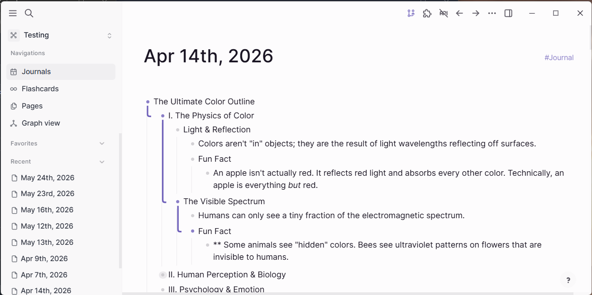
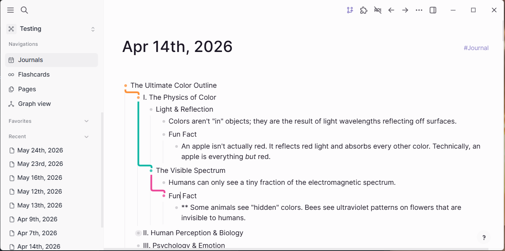

# Degrande Bullet Threading

Colorful bullet threading for Logseq DB graphs. Highlights the active path from the root block to the one you're editing, making it easy to see where you are in deep outlines.

## Features

- **Active-path threading** — draws a colored line from the root block down to your selected block so you never lose context in nested outlines.
- **Accent colors** — pick a custom hex color, choose from preset swatches, or use the rainbow mode that gives each depth level its own color.
- **Thread width** — 1 px, 2 px, 3 px, or 4 px.
- **Thread shape** — Square (sharp bends) or Rounded (smooth corners).
- **Thread end** — Top (line arrives above the bullet) or Side (line arrives beside the bullet).
- **Motion** — Still, Drift, or Pulse animation on the thread line.
- **Settings panel** — click the toolbar icon to open a visual settings panel with live preview right inside Logseq.

## Installation

### From the Logseq Marketplace

1. Open **Logseq** → **Settings** → **Plugins** → **Marketplace**.
2. Search for **Degrande Bullet Threading**.
3. Click **Install**.

### Load Unpacked (development)

1. Enable **Developer mode** in Logseq settings.
2. Open **Plugins** → **Load unpacked plugin**.
3. Select the `logseq-db-degrande-bullet-threading` folder.

## Usage

Once installed, threading activates automatically when you click into a block. Open the settings panel from the toolbar icon to adjust colors, width, shape, end mode, and motion.

## Requirements

- Logseq Desktop with a **DB graph** (not file-graph).

## License

MIT